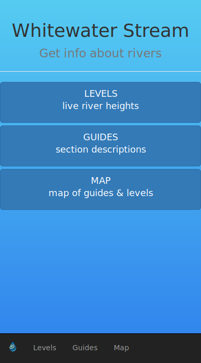

### Introduction

This repo holds the code for the whitewater.stream website which I am developing.

### Technology stack

* Reactjs front end served from S3
* Serverless Backend in Python served from AWS Lambda.
* AWS dynamoDb used for data storage.
* AWS Cognito used for user authentication. TODO

### Running the code

Just run `npm start` to run the website locally.

### Pushing to prod

Just run `make` and the makefile will build the scripts and push to prod.

Make sure you have your AWS credentials stored as environment variables.

## Photos

